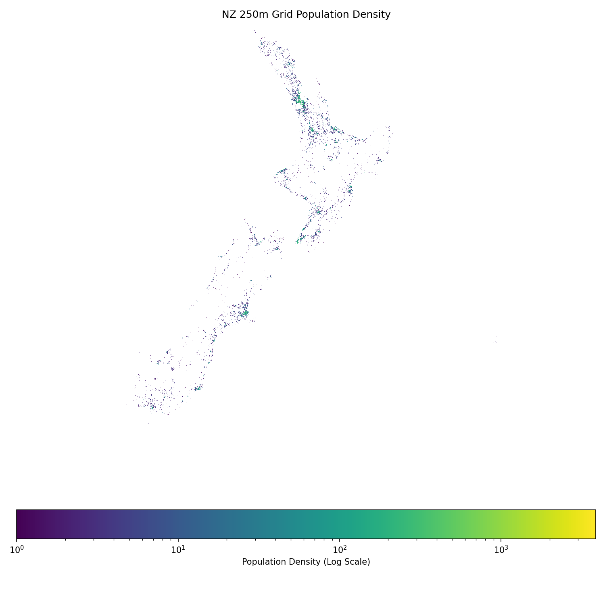
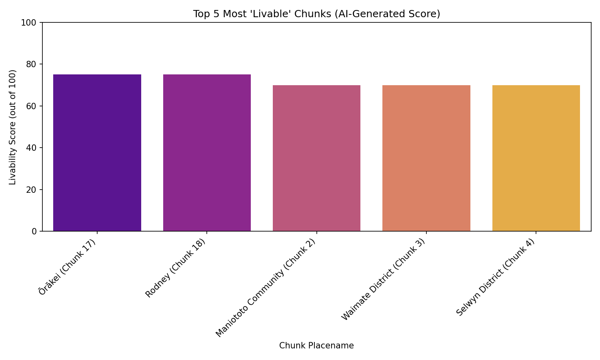
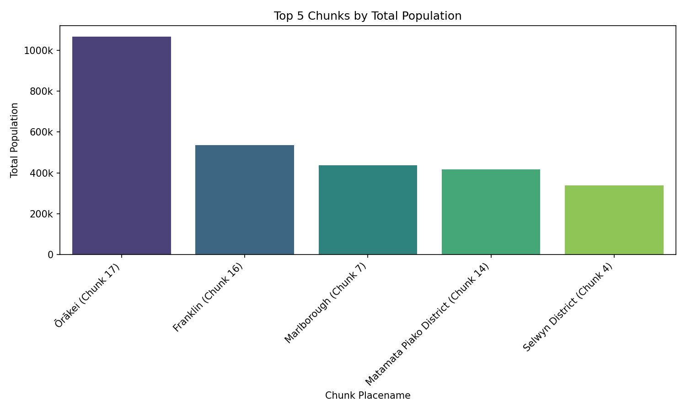

# NZ Population 250m Grid Analysis

This project analyzes New Zealand's population data on a 250m grid, generating various maps and reports.

## AI Model Used

The development, analysis, and code generation for this project were assisted by Google's Gemini model and Ollama (used in `analyze_population.py` for report generation and policy suggestions).

## Project Overview

This project is designed to process, analyze, and visualize New Zealand's estimated resident population data at a 250-meter grid resolution. It leverages geospatial analysis techniques to derive insights into population distribution and density, ultimately generating comprehensive reports and interactive maps.

The core workflow involves several stages:

1.  **Data Acquisition**: Automated retrieval of population data from a public ArcGIS FeatureServer API.
2.  **Data Preprocessing**: Cleaning, transformation, and preparation of raw data for analysis, including data validation, normalization, and error handling.
3.  **Geospatial Analysis & Visualization**: Processed data is subjected to geospatial analysis techniques to derive metrics such as population density. Visualization modules then render these insights into various graphical formats, including choropleth maps and statistical charts.
4.  **Report Generation**: Analytical findings, visualizations, and summary statistics are compiled into structured PDF reports for comprehensive documentation and dissemination.

Each stage is orchestrated via independent Python scripts, forming an Extract, Transform, Load (ETL) pipeline that converts raw data into actionable intelligence.

## Key Features & Technologies

*   **Data Acquisition**: Automatic data retrieval from the ArcGIS FeatureServer API.
*   **Data Preprocessing**: Cleaning, transforming, and validating data.
*   **Geospatial Analysis**: Analyzing population distribution and density using `geopandas`.
*   **Data Visualization**: Creating various graphs such as heatmaps and bar charts using `matplotlib` and `seaborn`.
*   **LLM (Large Language Model) Integration**: Automatically generates text reports and policy recommendations using a locally-run Ollama LLM (Llama 2), ensuring data privacy and cost-effectiveness.
*   **PDF Report Generation**: Using `fpdf` to compile analysis results, visualizations, and LLM outputs into structured PDFs.
*   **Coordinate Transformation**: Converting coordinate reference systems (CRS) using `pyproj`.
*   **Reverse Geocoding**: Obtains place names from coordinates using the free OpenStreetMap Nominatim API, contributing to lower operational costs and enhanced data security.
*   **Advanced Integration**: Combines multiple advanced technologies and concepts, including handling geospatial data and integrating LLMs.


## Setup

To get this project up and running on your local machine, follow these steps:

1.  **Clone the repository:**
    ```bash
    git clone https://github.com/your-username/nz_population_250_grid.git
    cd nz_population_250_grid
    ```

2.  **Create a virtual environment (recommended):**
    ```bash
    python -m venv .venv
    # On Linux/macOS:
    source .venv/bin/activate
    # On Windows:
    # .venv\Scripts\activate
    ```

3.  **Install dependencies:**
    ```bash
    pip install -r requirements.txt
    ```

4.  **Environment Variables (if any):**
    If your project requires API keys or other sensitive information, create a `.env` file in the root directory and add them there (e.g., `API_KEY=your_key_here`).

## How to Run

Follow these steps to execute the project's workflow:

1.  **Fetch Population Data:**
    ```bash
    python scripts/fetch_population.py
    ```
    This script is the data ingestion module. It programmatically retrieves New Zealand's estimated resident population (ERP) data at a 250-meter grid resolution from a public ArcGIS FeatureServer API. It handles API interaction, query construction, and a paging mechanism to fetch all available records, saving the aggregated data as `nz_population.geojson` in the `data` directory.

2.  **Preprocess Population Data:**
    ```bash
    python scripts/preprocess_population.py
    ```
    This script cleans and prepares the raw population data for analysis.

3.  **Analyze Population Data and Generate Outputs:**
    ```bash
    python scripts/analyze_population.py
    ```
    This script conducts the core geospatial analysis and generates all visual outputs. It includes **reverse geocoding functionality** that uses the OpenStreetMap Nominatim API to convert coordinates into human-readable place names for enhanced reporting and visualization. Please note that an active internet connection is required for the geocoding feature to work. This script will generate various maps and reports in the `outputs/` directory.

4.  **GeoJSON Validation (`diagnose_geojson.py`) (Optional)**:
    This utility script performs basic validation on a GeoJSON file (by default, `../data/nz_population.geojson`). It checks for file existence, successful loading, and identifies any empty or invalid geometries. It provides a diagnostic summary and recommendations for fixing issues, which is crucial for ensuring data quality before further analysis or visualization.
    ```bash
    python diagnose_geojson.py
    ```

## Project Outputs

### Key Visualizations

Here are some key outputs generated by the analysis:

*   **Population Report**: [NZ_Population_Report_20251017_081647.pdf](scripts/NZ_Population_Report_20251017_081647.pdf)
*   **Population Density Map**: 
*   **Top Livability Chunks**: 
*   **Top Population Chunks**: 

Upon successful execution, the project generates the following artifacts:

*   **Image Files (`.png`)**: High-resolution graphical representations of analytical results.
    *   `comparison_map.png`: Comparative spatial analysis visualization.
    *   `population_density_map.png`: Choropleth map illustrating population density distribution.
    *   `top_livability_chunks.png`: Visualization highlighting areas with high livability scores (based on defined criteria).
    *   `top_population_chunks.png`: Maps identifying grid cells with the highest population counts.
    *   `top_regions_bar.png`: Bar chart summarizing key metrics across defined regions.
*   **PDF Reports (`NZ_Population_Report_*.pdf`)**: Comprehensive reports detailing the analysis, including methodologies, findings, and integrated visualizations.
*   **Intermediate Data Files (`.pkl`)**: Python pickle files used for caching processed data to optimize subsequent runs.
*   **Population GeoJSON (`nz_population.geojson`)**: This file is an output of the `fetch_population.py` script, containing the raw population data retrieved from the ArcGIS API. It serves as the primary input for both the grid geometries and the population attributes for subsequent data preprocessing and analysis.

## Data Sources

The primary population data is sourced from the following ArcGIS FeatureServer API:

*   **Source**: ArcGIS Enterprise FeatureServer.
*   **API Endpoint**: `https://services2.arcgis.com/vKb0s8tBIA3bdocZ/arcgis/rest/services/NZGrid_250m_ERP/FeatureServer/1/query`
*   **Content**: New Zealand 250m Grid Estimated Resident Population (ERP).

The `fetch_population.py` script automates the retrieval of this data.

## Fonts

The project utilizes DejaVu fonts for consistent and high-quality rendering in visualizations and reports. Font files are located in the `dejavu-fonts/` directory.

---
**Disclaimer**: This documentation is based on an interpretation of file names and common project structures. For precise operational details and data specifics, direct consultation with the codebase or project maintainers is recommended.
